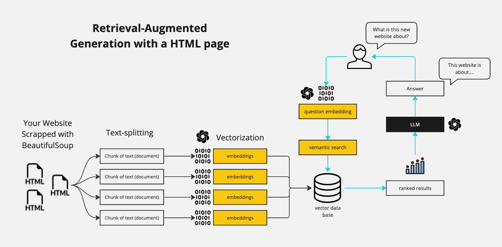

# Interactive Website Chatbot with Memory (LangChain + Streamlit)

This project is a Streamlit chatbot that loads a website URL, retrieves relevant context with RAG, and keeps chat memory for a full multi-turn conversation.

🟡 This repository is meant as supporting material for the [Youtube video tutorial](https://youtu.be/bupx08ZgSFg).

## Features
- **Interactive chat UI** with Streamlit chat components.
- **Conversation memory** across turns in the active session.
- **RAG over website content** using LangChain + Chroma.
- **Configurable modern OpenAI models** (chat + embeddings) from the sidebar.
- **Python-based** implementation.

## Brief explanation of how RAG works

A RAG bot is short for Retrieval-Augmented Generation. This means that we are going to "augment" the knowledge of our LLM with new information that we are going to pass in our prompt. We first vectorize all the text that we want to use as "augmented knowledge" and then look through the vectorized text to find the most similar text to our prompt. We then pass this text to our LLM as a prefix.

This is more clearly explained in the [Youtube video tutorial](https://youtu.be/bupx08ZgSFg), but here is a diagram that shows the process:



## Installation
Ensure you have Python installed on your system. Then clone this repository:

```bash
git clone [repository-link]
cd [repository-directory]
```

Install dependencies:

```bash
pip install -r requirements.txt
```

Create a `.env` file:

```bash
OPENAI_API_KEY=your-openai-api-key
```

## Usage
Run the app:

```bash
streamlit run src/app.py
```

## Contributing
This repository is meant as supporting material for the [Youtube video tutorial](https://youtu.be/bupx08ZgSFg). Therefore, I am not accepting any pull requests unless they are for fixing bugs or typos.

## License
This project is licensed under the MIT License - see the LICENSE file for details.

---

**Note**: This project is for educational and research purposes. Ensure to comply with the terms of use and guidelines of the utilized APIs and services.

---

I hope this repository helps you in your journey of exploring AI and chatbot development. For more information and tutorials, check out [Your YouTube Channel].

Happy Coding! 🚀👨‍💻🤖

---

*Don't forget to star this repo if you find it useful!*

---
